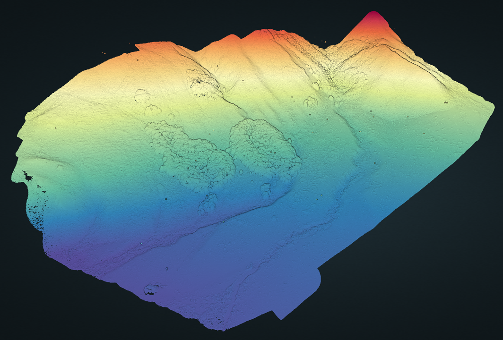
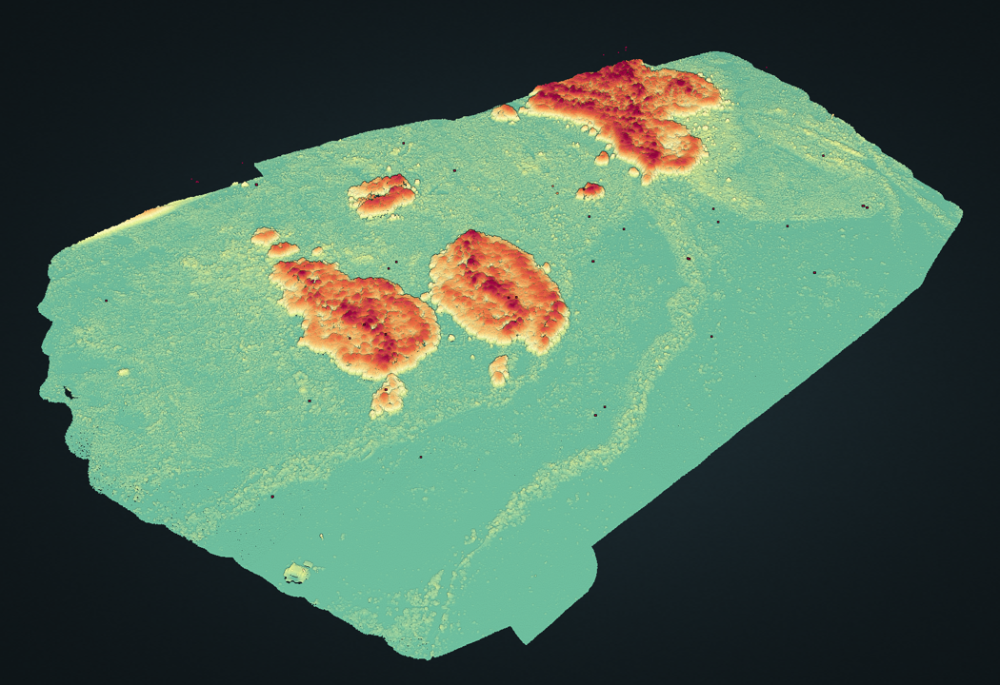

# Integrated Remote Sensing Studio Analysis of Cass, NZ

  

This repository contains code and products for a remote sensing assessment of Cass, New Zealand, a unique beech forest located in the Southern Alps mountain range. The project is a collaboration between researchers at the University of British Columbia's Integrated Remote Sensing Studio (IRSS) and the University of Canterbury in Christchurch, New Zealand.

This work builds on a comprehensive assessment of vegetation structure change at Cass avaliable in: 

## Project Overview

The goal of this project is to assess the structural diversity of beech forest clusters in Cass, New Zealand, and to understand their expansion and growth over time. To achieve this, we are utilizing drone data collected from a DJI Matrice 300 RTK with the Zenmuse L1 lidar, P1 RGB sensor, and H20t thermal sensor. This data is combined with historical aerial imagery from 2006 (0.75m resolution) and 2016 (0.30m resolution) to provide a comprehensive analysis of the forest dynamics.

## Cass, NZ

Cass is a unique study site located in the eastern South Island high country of New Zealand. Previous work by [Young et al. 2016](https://newzealandecology.org/nzje/3276) conducted a grid-based assessment to classify vegetation and determine factors influencing vegetation patterns. The study found seven vegetation types: grassland, mixed shrubland, mānuka shrubland, mountain beech forest, gorse shrubland, wetlands, and subalpine vegetation. The results showed that native woody vegetation, mainly shrubland, now dominates the Cass landscape, in contrast to the early 20th century when short tussock grassland prevailed. The study suggests that, with appropriate management, these transitional shrublands could be replaced by mountain beech forests in the long term. Exotic species play a significant role in the Cass area, particularly at lower elevations and on gentle slopes.

### Unique Disturbance History and Invasive Species

The Cass site has a unique disturbance history, characterized by a complex mixture of fire events, grazing intensity, and invasive species. The history of fire at the site has played a significant role in shaping the vegetation patterns, with evidence of fires dating back to the 1850s. Grazing has also contributed to the current vegetation mosaic, with historical stocking rates much higher than present-day levels. Invasive species, such as gorse and exotic grasses, have further contributed to the complex vegetation patterns observed at Cass.

One of the key features of the vegetation at Cass today is the emergence of shrubland, which has occurred with the relaxation of the fire regime and lower stocking rate. Native shrubland now dominates, with 43% of plots classified as mānuka and mixed shrublands, and 53% of all plots having a woody cover of >10%. In the long term, it is probable that most of the shrubland types will eventually converge towards Fuscospora cliffortioides dominated forest.

### Fine-Scale Remote Sensing in Follow-Up Project

In our follow-up project, we plan to expand the results of this initial study beyond the bounds of plots by utilizing fine-scale remote sensing drone-based LiDAR, imagery, and thermal data. This technology may allow us to accurately map the spatial distribution of vegetation types, assess the extent of invasive species, and evaluate the impact of historical disturbances on the landscape. By integrating this high-resolution data we will be able to create a more comprehensive understanding of the complex vegetation dynamics at Cass and inform future management strategies.

The integration of lidar, RGB imagery, and thermal data will allow us to assess the structural and functional aspects of vegetation, providing valuable insights into the ongoing successional processes and the potential impact of climate change on the Cass landscape. Ultimately, this follow-up project will enhance our understanding of the vegetation dynamics at Cass and inform more effective management strategies for conserving and restoring this unique landscape.

Citation:

Young, L. M., Norton, D. A., & Lambert, M. T. (2016). One hundred years of vegetation change at Cass, eastern South Island high country. New Zealand Journal of Ecology, 40(3), 289-308.

## Data Sources

1. **DJI Matrice 300 RTK Drone Data**: High-resolution drone data collected using the following sensors:
    - Zenmuse L1 lidar: Provides accurate 3D point cloud data for analyzing forest structure
    - P1 RGB sensor: Captures high-resolution RGB images for visual analysis and classification
    - H20t thermal sensor: Measures temperature variations across the forest, which can provide insights into plant health and stress levels, and thermal dynamics

  
  

2. **Historical Aerial Imagery**: Aerial photographs from 2006 (0.75m resolution) and 2016 (0.30m resolution) to assess changes in the forest's structure and expansion over time.

3. **Mobile Laser Scanning (MLS)**: High-resolution mobile laser scanning data collected using the GeoSLAM Zeb Horizon, a lightweight, handheld scanner capable of capturing 300,000 points per second, with an accuracy of up to 3 cm. This data complements the drone and aerial imagery by providing detailed ground-based measurements of the forest structure.

  

## Methodology

1. **Forest Structure Analysis**: Using lidar point cloud data and a suite of available lidar metrics from the [lidRmetrics](https://github.com/ptompalski/lidRmetrics), we analyze the vertical and horizontal structure of the beech forest clusters.

2. **Change Detection**: By comparing historical aerial imagery with recent drone data, we assess the expansion and growth of beech forest clusters over time. We employ various change detection techniques, including image differencing, classification comparison, and object-based analysis.

3. **Data Visualization**: Results are visualized using maps, graphs, and statistical analyses of variance

## Repository Structure

- `data/`: Contains raw and processed data files, excluding drone data and historical aerial imagery which are too large for repository
- `src/`: Contains source code for data preprocessing, analysis, and visualization
- `results/`: Contains output files; maps, graphs, and tables, generated from the analysis
- `docs/`: Contains project documentation

## Structural Metrics

  

