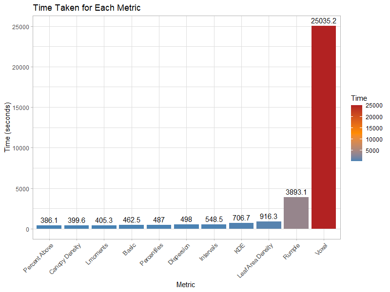

# IRSS_Cass

<p align="center">
  
  
</p>

This repository contains code and products for a remote sensing assessment of Cass, New Zealand, a unique beech forest located in the Southern Alps mountain range. The project is a collaboration between researchers at the University of British Columbia's Integrated Remote Sensing Studio (IRSS) and the University of Canterbury in Christchurch, New Zealand.

## Project Overview

The goal of this project is to assess the structural diversity of beech forest clusters in Cass, New Zealand, and to understand their expansion and growth over time. To achieve this, we are utilizing drone data collected from a DJI Matrice 300 RTK with the Zenmuse L1 lidar, P1 RGB sensor, and H20t thermal sensor. This data is combined with historical aerial imagery from 2006 (0.75m resolution) and 2016 (0.30m resolution) to provide a comprehensive analysis of the forest dynamics.

## Data Sources

1. **DJI Matrice 300 RTK Drone Data**: High-resolution drone data collected using the following sensors:
    - Zenmuse L1 lidar: Provides accurate 3D point cloud data for analyzing forest structure
    - P1 RGB sensor: Captures high-resolution RGB images for visual analysis and classification
    - H20t thermal sensor: Measures temperature variations across the forest, which can provide insights into plant health and stress levels, and thermal dynamics

2. **Historical Aerial Imagery**: Aerial photographs from 2006 (0.75m resolution) and 2016 (0.30m resolution) to assess changes in the forest's structure and expansion over time.

## Methodology

1. **Forest Structure Analysis**: Using lidar point cloud data and a suite of available lidar metrics from the [lidRmetrics](https://github.com/ptompalski/lidRmetrics), we analyze the vertical and horizontal structure of the beech forest clusters.

2. **Change Detection**: By comparing historical aerial imagery with recent drone data, we assess the expansion and growth of beech forest clusters over time. We employ various change detection techniques, including image differencing, classification comparison, and object-based analysis.

3. **Data Visualization**: Results are visualized using maps, graphs, and other visual aids to effectively communicate our findings.

## Repository Structure

- `data/`: Contains raw and processed data files, including drone data and historical aerial imagery
- `src/`: Contains source code for data preprocessing, analysis, and visualization
- `results/`: Contains output files, such as maps, graphs, and tables, generated from the analysis
- `docs/`: Contains project documentation, including reports and presentations

## Getting Started

1. Clone this repository to your local machine.
2. Install required dependencies.
3. Run the scripts in the `src/` directory to preprocess the data and perform the analysis.
4. Visualize the results using the scripts in the `results/` directory.

## Study Area

```R
# Load required packages
library(sf)
library(leaflet)

# Read the GeoPackage containing the study area boundary
study_area_boundary <- st_read("data/beech_extent.gpkg")

# Create an interactive map
leaflet(study_area_boundary) %>%
  addTiles() %>%
  addPolygons(fillColor = "#74a9cf", stroke = TRUE, color = "#045a8d", weight = 2, opacity = 1, fillOpacity = 0.5)

```

## Structural Metrics

<p align="center">
  
</p>
