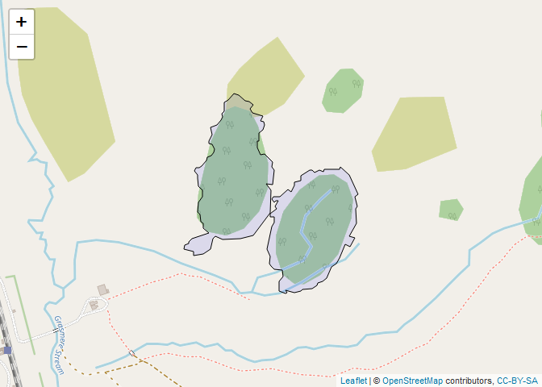

``` r
# Load required libraries
library(leaflet)
library(sf)
```

    ## Linking to GEOS 3.9.3, GDAL 3.5.2, PROJ 8.2.1; sf_use_s2() is TRUE

``` r
library(rgdal)
```

    ## Loading required package: sp

    ## Please note that rgdal will be retired during 2023,
    ## plan transition to sf/stars/terra functions using GDAL and PROJ
    ## at your earliest convenience.
    ## See https://r-spatial.org/r/2022/04/12/evolution.html and https://github.com/r-spatial/evolution
    ## rgdal: version: 1.6-5, (SVN revision 1199)
    ## Geospatial Data Abstraction Library extensions to R successfully loaded
    ## Loaded GDAL runtime: GDAL 3.5.2, released 2022/09/02
    ## Path to GDAL shared files: C:/Users/lakirwin.stu/AppData/Local/R/win-library/4.3/rgdal/gdal
    ## GDAL binary built with GEOS: TRUE 
    ## Loaded PROJ runtime: Rel. 8.2.1, January 1st, 2022, [PJ_VERSION: 821]
    ## Path to PROJ shared files: C:/Users/lakirwin.stu/AppData/Local/R/win-library/4.3/rgdal/proj
    ## PROJ CDN enabled: FALSE
    ## Linking to sp version:1.6-0
    ## To mute warnings of possible GDAL/OSR exportToProj4() degradation,
    ## use options("rgdal_show_exportToProj4_warnings"="none") before loading sp or rgdal.

``` r
# Read study area polygon
study_area <- st_read("data/_vector/Beech_mask.shp") %>% st_transform(4326)
```

    ## Reading layer `Beech_mask' from data source 
    ##   `C:\Users\lakirwin.stu\Documents\GitHub\IRSS_Cass\data\_vector\Beech_mask.shp' 
    ##   using driver `ESRI Shapefile'
    ## Simple feature collection with 2 features and 2 fields
    ## Geometry type: POLYGON
    ## Dimension:     XY
    ## Bounding box:  xmin: 562042.5 ymin: 5235050 xmax: 562422.6 ymax: 5235483
    ## Projected CRS: NZGD2000 / UTM zone 59S

``` r
# Create the leaflet map
mymap <- leaflet(study_area) %>%
  addTiles() %>%
  addPolygons(fillColor = "blue",
              color = "black",
              weight = 1,
              opacity = 1,
              fillOpacity = 0.1,
              smoothFactor = 1)
  
mymap
```

<!-- -->
